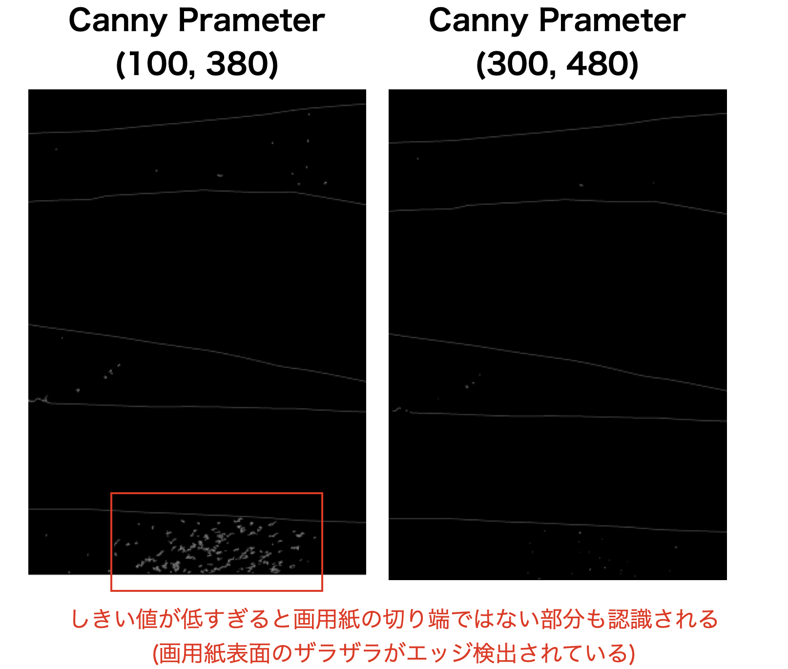

# 画用紙の切れ端の分類
PatchCoreという異常検出の手法を利用して、画用紙の切れ端をが綺麗かどうかを判別するコードを作成しました。

google colab  
https://colab.research.google.com/drive/1xYL8AhVqb1mvxlKeEhdwFMVhZKrz2sCE?usp=sharing

原著論文 :   
Towards Total Recall in Industrial Anomaly Detection (Jun 2021)  
Karsten Roth, Latha Pemula, Joaquin Zepeda, Bernhard Schölkopf, Thomas Brox, Peter Gehler  
https://arxiv.org/abs/2106.08265  
https://paperswithcode.com/sota/anomaly-detection-on-mvtec-ad

参考にしたコード:  
https://github.com/hcw-00/PatchCore_anomaly_detection/tree/main  
(さらに、上記コードの中で引用されていたコード)  
kcenter algorithm :  
https://github.com/google/active-learning  
embedding concat function :  
https://github.com/xiahaifeng1995/PaDiM-Anomaly-Detection-Localization-master

### 以下、改変した点について
- google colabでの動作を前提として、引数の渡し方を変更。
- 画像のAugmentationを変更。色味の変更や回転をさせることで、さまざまな向きの画用紙画像に対応できるようにする。
~~~
self.data_transforms = transforms.Compose([
                    #transforms.Resize((load_size, load_size), Image.ANTIALIAS),
                    transforms.ToTensor(),
                    #transforms.CenterCrop(input_size),
                    transforms.RandomRotation(90),
                    transforms.ColorJitter(brightness=0.05,contrast=0.05),
                    transforms.Normalize(mean=mean_train, std=std_train)
                    ])
~~~
- train_dataloader,test_data_loader について、引数で画用紙の画像を渡すように変更した。
- on_test_start で 事前にハサミで切った画用紙の切れ端の画像だけで学習したpre_index.faissファイルをデータバンクとして使用するように変更。
- pixelレベルでの評価のための記述は全て削除した。
- min_max_norm について、ヒートマップの作成について、判定した画像全体で最大の異常スコアの値でスケーリングするように変更。(global_maxが判定した画像全体での異常値の最大値)
~~~
def min_max_norm(image, global_max):
    a_min, a_max = image.min(), image.max()
    return (image-a_min)/(global_max - a_min)
~~~

### paper_detect.py (gayoshi_danmenクラス)について
参照: 
https://docs.opencv.org/3.4/da/d22/tutorial_py_canny.html

canny法によるエッジ検出を行う。閾値パラメータを２つ(min, max)を設定する。  
これら２つのパラメーターが大きいほど、コントラストがより強い部分のみエッジとして検出される。 

